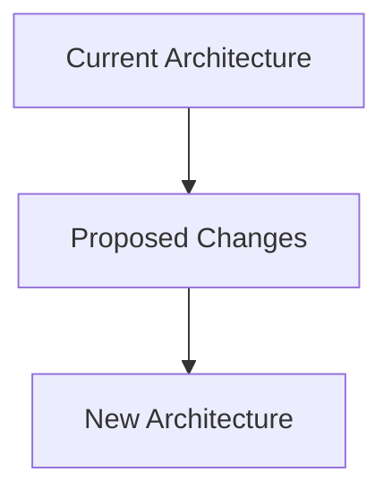

# RFC Template - Namespaces SDK

## RFC Metadata
- **RFC ID**: RFC-YYYYMMDD-XXXX
- **Status**: Draft | In Review | Approved | Implemented | Rejected
- **Type**: Feature | Enhancement | Bug Fix | Breaking Change
- **Created**: YYYY-MM-DD
- **Author**: [Author Name]
- **Reviewer**: [Reviewer Name]
- **Approver**: [Approver Name]

## 1. Summary
Brief description of the proposed change (1-2 sentences).

## 2. Motivation
Why is this change necessary? What problem does it solve?

### Current State
Describe the current situation and its limitations.

### Desired State
Describe what the proposed change will achieve.

## 3. Detailed Design

### 3.1 Architecture Changes


### 3.2 API Changes
If applicable, describe API modifications.

#### New Endpoints
- `GET /api/v1/new-endpoint` - Description

#### Modified Endpoints
- `PUT /api/v1/modified-endpoint` - Changes

### 3.3 Configuration Changes
```yaml
# New configuration options
new_feature:
  enabled: true
  timeout: 30s
```

### 3.4 Database Schema Changes
If applicable, describe schema modifications.

## 4. Implementation Plan

### Phase 1: Core Implementation
- [ ] Implement basic functionality
- [ ] Add unit tests
- [ ] Update documentation

### Phase 2: Integration
- [ ] Integrate with existing systems
- [ ] Add integration tests
- [ ] Performance testing

### Phase 3: Deployment
- [ ] Feature flag implementation
- [ ] Gradual rollout
- [ ] Monitoring setup

## 5. Testing Strategy

### Unit Tests
- Coverage goal: >95%
- Key test cases:
  - [ ] Test case 1
  - [ ] Test case 2

### Integration Tests
- [ ] Test integration with component A
- [ ] Test integration with component B

### Performance Tests
- [ ] Load testing with X concurrent users
- [ ] Latency validation (<100ms)

## 6. Rollout Plan

### Timeline
- **Week 1**: Development
- **Week 2**: Testing
- **Week 3**: Staging deployment
- **Week 4**: Production rollout

### Risk Mitigation
| Risk | Impact | Mitigation |
|------|--------|------------|
| Risk 1 | High | Mitigation strategy |
| Risk 2 | Medium | Mitigation strategy |

## 7. Monitoring & Observability

### Metrics to Track
- `feature_success_rate` - Success rate of new feature
- `feature_latency_ms` - Response time for new feature
- `feature_error_rate` - Error rate

### Alerting Rules
- Alert if success rate < 95%
- Alert if latency > 100ms

## 8. Documentation Updates

### Required Documentation
- [ ] API documentation update
- [ ] User guide update
- [ ] Developer documentation
- [ ] Architecture diagrams

## 9. Security Considerations

### Security Impact
- [ ] Authentication changes required
- [ ] Authorization changes required
- [ ] Data privacy considerations
- [ ] Audit trail requirements

## 10. Backwards Compatibility

### Compatibility Impact
- **Breaking Changes**: Yes/No
- **Migration Required**: Yes/No
- **Deprecation Timeline**: [If applicable]

## 11. Alternatives Considered

### Option A: [Description]
Pros:
- Pro 1
- Pro 2

Cons:
- Con 1
- Con 2

### Option B: [Description]
Pros:
- Pro 1
- Pro 2

Cons:
- Con 1
- Con 2

### Chosen Option: [Reason for selection]

## 12. Open Questions

1. Question 1?
2. Question 2?

## 13. Glossary

| Term | Definition |
|------|------------|
| Term 1 | Definition |
| Term 2 | Definition |

## 14. References

- [Reference 1](URL)
- [Reference 2](URL)

## 15. Approval History

| Date | Action | Person |
|------|--------|--------|
| YYYY-MM-DD | Created | [Author] |
| YYYY-MM-DD | Reviewed | [Reviewer] |
| YYYY-MM-DD | Approved | [Approver] |

---

## Governance Compliance Checklist

### Machine Native Ops Compliance
- [x] Follows instant system principles
- [x] Maintains <100ms response time
- [x] Supports 64-256 parallel agents
- [x] Zero human intervention design
- [x] Event-driven architecture

### Security & Compliance
- [x] Security impact assessed
- [x] Data privacy considered
- [x] Audit trail implemented
- [x] Access control defined

### Documentation Standards
- [x] Comprehensive documentation
- [x] Clear implementation steps
- [x] Testing strategy defined
- [x] Rollback plan included

---

**Status**: [Draft | In Review | Approved | Implemented | Rejected]
**Next Action**: [Next step in the process]